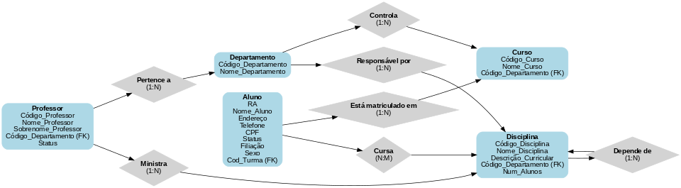

# Modelagem de Dados do Sistema de Gerenciamento de Faculdade

## Dicionário de Atributos

### Aluno
| Atributo         | Tipo de Dados | Descrição                               |
|------------------|---------------|-----------------------------------------|
| RA               | INT           | Registro acadêmico do aluno (chave primária). |
| Nome_Aluno       | VARCHAR(100)  | Nome completo do aluno.                |
| Endereço         | TEXT          | Dados completos do endereço do aluno.  |
| Código_Curso     | INT           | Referência ao curso matriculado (chave estrangeira). |
| CPF              | CHAR(11)      | Cadastro de Pessoa Física (único).     |
| Status           | ENUM('Ativo', 'Inativo') | Estado atual do aluno. |

### Professor
| Atributo          | Tipo de Dados | Descrição                              |
|-------------------|---------------|----------------------------------------|
| Código_Professor  | INT           | Identificação única do professor (chave primária). |
| Nome_Professor    | VARCHAR(100)  | Nome do professor.                    |
| Código_Departamento | INT         | Referência ao departamento (chave estrangeira). |

### Disciplina
| Atributo          | Tipo de Dados | Descrição                              |
|-------------------|---------------|----------------------------------------|
| Código_Disciplina | INT           | Identificador único da disciplina (chave primária). |
| Nome_Disciplina   | VARCHAR(100)  | Nome da disciplina.                   |
| Código_Departamento | INT         | Departamento responsável pela disciplina (chave estrangeira). |

...

## Normalização
### Primeira Forma Normal (1FN)
- Garantimos que todos os atributos são atômicos.
- Removemos valores multivalorados, como `Telefone` e `Contato`, para tabelas separadas.

### Segunda Forma Normal (2FN)
- Removemos dependências parciais.
- Criamos tabelas independentes para entidades relacionadas, como `Disciplina_Pre_Requisito`.

### Terceira Forma Normal (3FN)
- Eliminamos dependências transitivas.
- Certificamos que atributos não-chave dependem apenas de sua chave primária.

...

### Diagrama Entidade-Relacionamento

---

